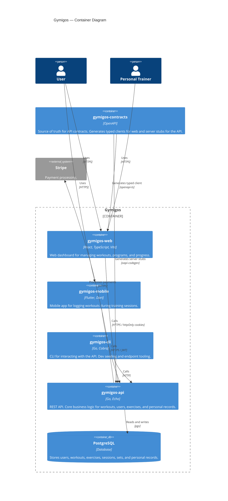

# C4 Container — Gymigos

How the Gymigos system is decomposed into containers and how they interact.

```mermaid
C4Container
  title Gymigos — Container Diagram

  Person(user, "User")
  Person(trainer, "Personal Trainer")

  Container_Boundary(gymigos, "Gymigos") {
    Container(web, "gymigos-web", "React, TypeScript, Vite", "Web dashboard for managing workouts, programs, and progress.")
    Container(mobile, "gymigos-mobile", "Flutter, Dart", "Mobile app for logging workouts during training sessions.")
    Container(cli, "gymigos-cli", "Go, Cobra", "CLI for interacting with the API. Dev seeding and endpoint tooling.")
    Container(api, "gymigos-api", "Go, Echo", "REST API. Core business logic for workouts, users, exercises, and personal records.")
    ContainerDb(db, "PostgreSQL", "Database", "Stores users, workouts, exercises, sessions, sets, and personal records.")
  }

  Container(contracts, "gymigos-contracts", "OpenAPI", "Source of truth for API contracts. Generates typed clients for web and server stubs for the API.")

  System_Ext(stripe, "Stripe", "Payment processing.")

  Rel(user, web, "Uses", "HTTPS")
  Rel(user, mobile, "Uses", "HTTPS")
  Rel(trainer, web, "Uses", "HTTPS")
  Rel(cli, api, "Calls", "HTTP")
  Rel(web, api, "Calls", "HTTPS / httpOnly cookies")
  Rel(mobile, api, "Calls", "HTTPS / JWT")
  Rel(api, db, "Reads and writes", "pgx")
  Rel(api, stripe, "Processes payments", "HTTPS")
  Rel(contracts, web, "Generates typed client", "openapi-ts")
  Rel(contracts, api, "Generates server stubs", "oapi-codegen")
```

> Stripe is planned for a future phase.
