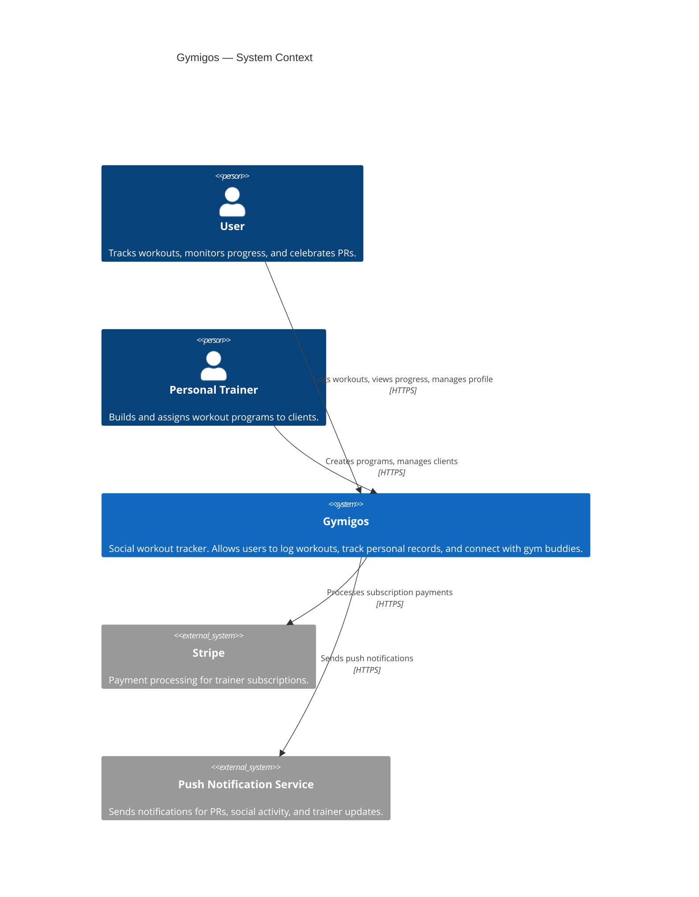

# C4 Context — Gymigos

High-level view of Gymigos and the people and systems that interact with it.

```mermaid
C4Context
  title Gymigos — System Context

  Person(user, "User", "Tracks workouts, monitors progress, and celebrates PRs.")
  Person(trainer, "Personal Trainer", "Builds and assigns workout programs to clients.")

  System(gymigos, "Gymigos", "Social workout tracker. Allows users to log workouts, track personal records, and connect with gym buddies.")

  System_Ext(stripe, "Stripe", "Payment processing for trainer subscriptions.")
  System_Ext(push, "Push Notification Service", "Sends notifications for PRs, social activity, and trainer updates.")

  Rel(user, gymigos, "Logs workouts, views progress, manages profile", "HTTPS")
  Rel(trainer, gymigos, "Creates programs, manages clients", "HTTPS")
  Rel(gymigos, stripe, "Processes subscription payments", "HTTPS")
  Rel(gymigos, push, "Sends push notifications", "HTTPS")
```

> Stripe and push notifications are planned for future phases.
