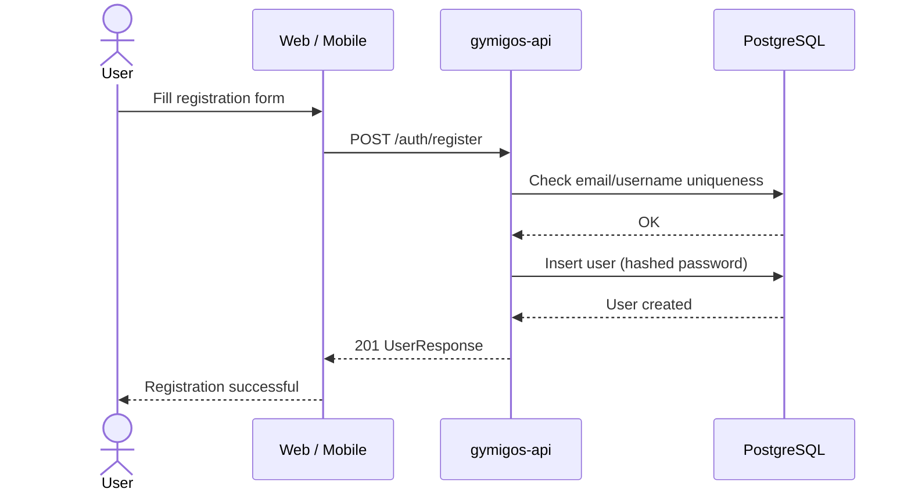
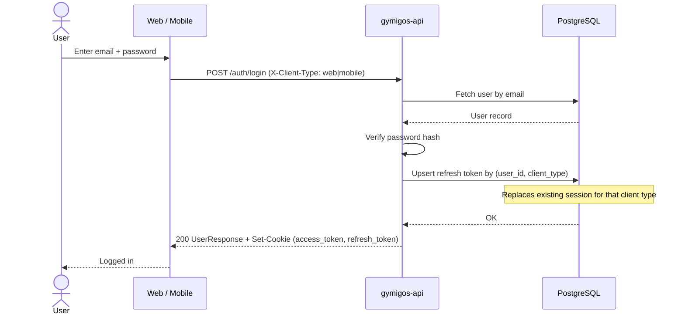
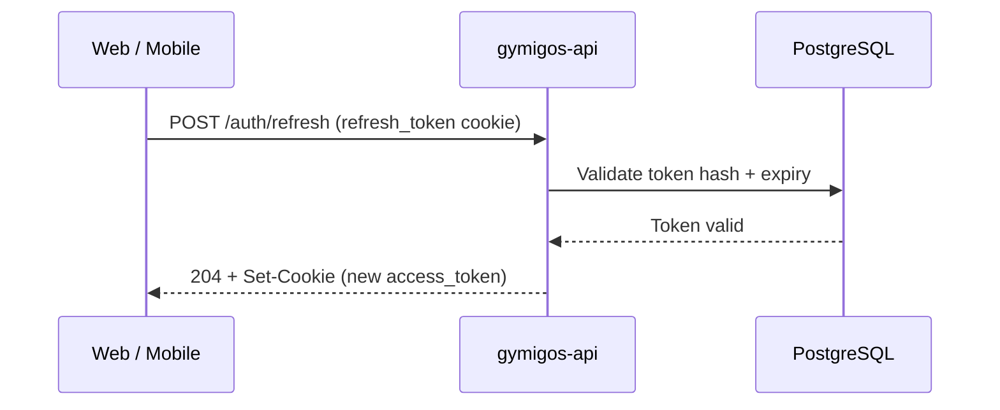
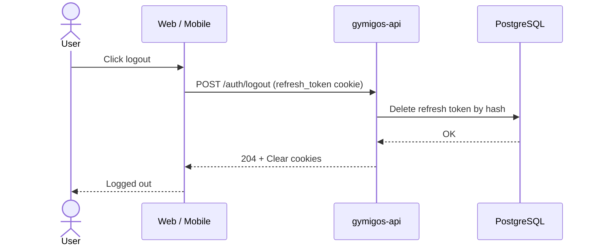

# Auth Flow

Sequence diagram for registration, login, token refresh, and logout.

## Register

## Login

Clients send `X-Client-Type: web | mobile` to identify the session type. Each user may have at most one active session per client type — logging in replaces the previous session of the same type atomically.

## Token Refresh

## Logout

