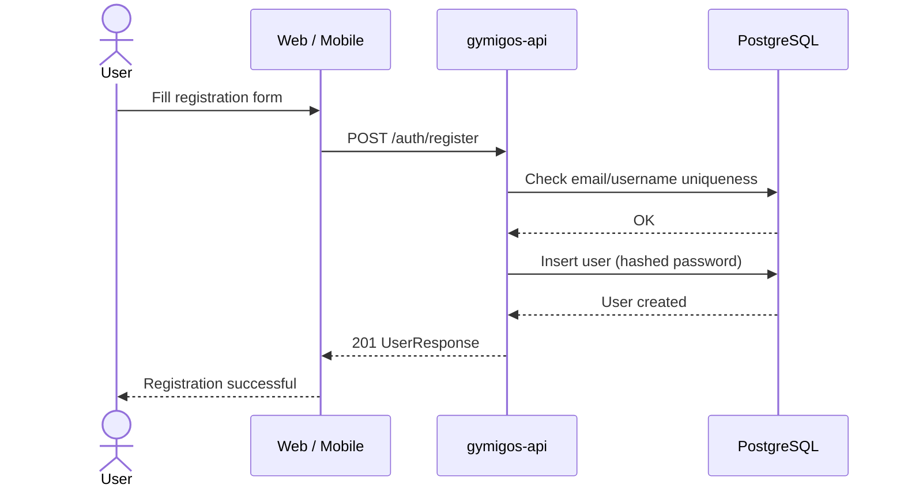
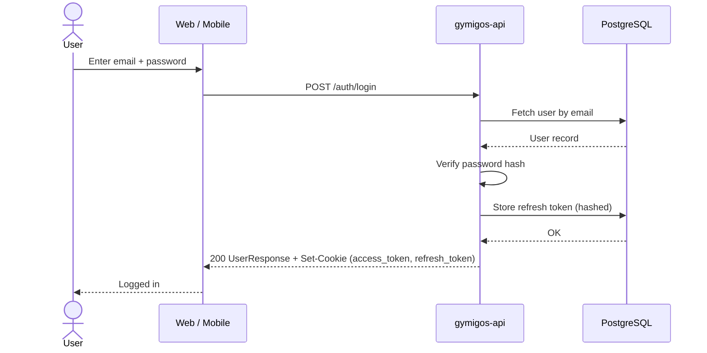
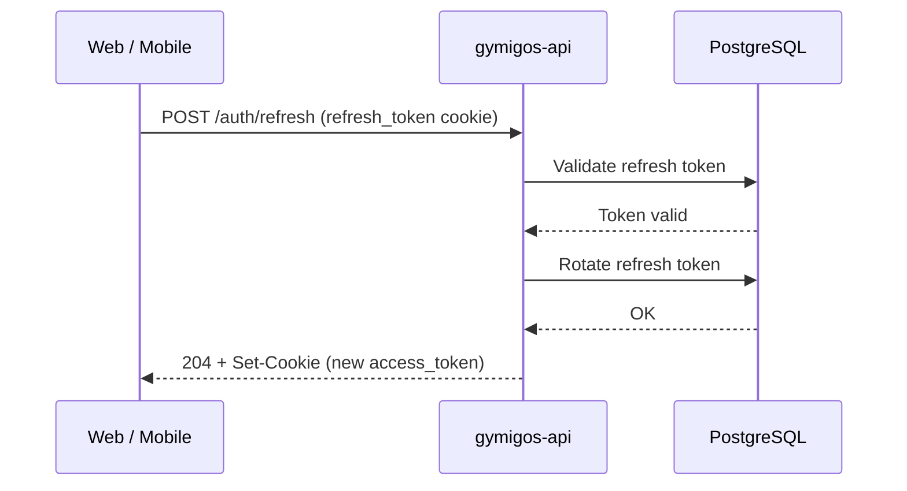
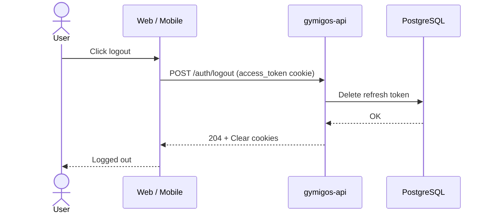

# Auth Flow

Sequence diagram for registration, login, token refresh, and logout.

## Register

```mermaid
sequenceDiagram
  actor User
  participant Client as Web / Mobile
  participant API as gymigos-api
  participant DB as PostgreSQL

  User->>Client: Fill registration form
  Client->>API: POST /auth/register
  API->>DB: Check email/username uniqueness
  DB-->>API: OK
  API->>DB: Insert user (hashed password)
  DB-->>API: User created
  API-->>Client: 201 UserResponse
  Client-->>User: Registration successful
```

## Login

```mermaid
sequenceDiagram
  actor User
  participant Client as Web / Mobile
  participant API as gymigos-api
  participant DB as PostgreSQL

  User->>Client: Enter email + password
  Client->>API: POST /auth/login
  API->>DB: Fetch user by email
  DB-->>API: User record
  API->>API: Verify password hash
  API->>DB: Store refresh token (hashed)
  DB-->>API: OK
  API-->>Client: 200 UserResponse + Set-Cookie (access_token, refresh_token)
  Client-->>User: Logged in
```

## Token Refresh

```mermaid
sequenceDiagram
  participant Client as Web / Mobile
  participant API as gymigos-api
  participant DB as PostgreSQL

  Client->>API: POST /auth/refresh (refresh_token cookie)
  API->>DB: Validate refresh token
  DB-->>API: Token valid
  API->>DB: Rotate refresh token
  DB-->>API: OK
  API-->>Client: 204 + Set-Cookie (new access_token)
```

## Logout

```mermaid
sequenceDiagram
  actor User
  participant Client as Web / Mobile
  participant API as gymigos-api
  participant DB as PostgreSQL

  User->>Client: Click logout
  Client->>API: POST /auth/logout (access_token cookie)
  API->>DB: Delete refresh token
  DB-->>API: OK
  API-->>Client: 204 + Clear cookies
  Client-->>User: Logged out
```
